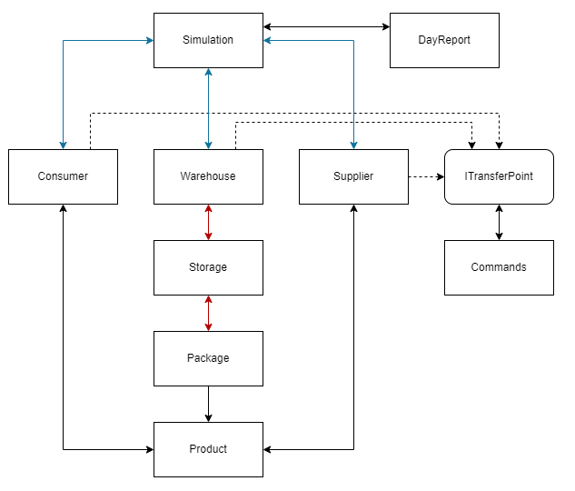
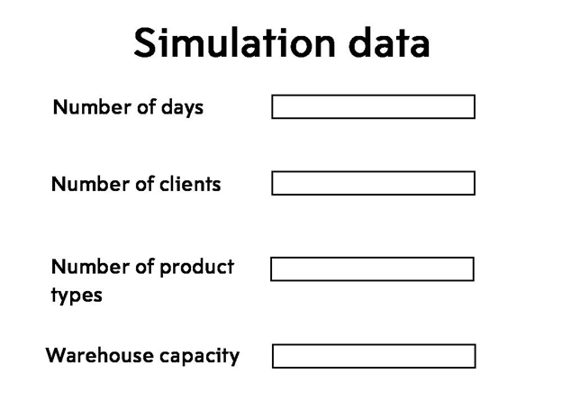

# Warehouse Simulation
## Модель обмена продуктами
Допустим у нас есть *объект 1* который имеет некоторое количество продуктов и *объект 2* который хочет сделать заказ на некторое количество продукции, тогда процесс обмен произойдёт в 5 этапов:
1. *Объект 2* оповещает *Объект 1* что хочет сделать заказ, делая запрос(Request)
2. *Объект 1* получает запрос и отправляет ответ(Answer) сколько продуктов возможно отправить
3. *Объект 2* получает ответ и делает заказ(Order) исходя их количества доступных продуктов
4. *Объект 1* получает заказ, создаёт отправление(Transmission) и передаёт его в транспортную службу(TransferService)
5. Транспортная служба через некоторое время доставляет отправление в *Объект 2*

## Основные классы
### Product
Класс Product является представлением абстрактного продукта, который содержит в себе информацию о названии, стоимости и сроке годности. Объявлен в "Product.h", который также включает в себя список всех типов продуктов в unordered map, для удобного создания экземпляров получая данные из таблицы.
```cpp
class Product {
public:
	// Default
	Product();
	// For non-rottable
	Product(std::string name, int price);
	// For rottable
	Product(std::string name, int price, int expiryTime);
	const std::string& name() const;
	int price() const;
	double freshness() const;
	void rot();
	bool isRotten();
	
	static std::vector<std::string> names;
	static std::tr1::unordered_map<std::string, const Product> list;
private:
	std::string name_ = "N/A";
	int price_ = 0;
	int expiryTime_ = 0;
	int maxExpiryTime_ = 0;
	bool isRottable_ = false;
};
```

### Package
Класс Package отнаследован от класса Product, т.к. подразумевается что в упаковке все продукты одинаковые. В классе определены несколько дополнительных методов позволющие работать с упаковкой. Объявлен в "Package.h".
```cpp
class Package : public Product {
public:
	Package();
	Package(Product type, int count);
	int priceAll();
	int count();
private:
	int count_ = 0;
};
```

### Commands(Request, Answer, Order, Transmission)
Request, Answer, Order, Transmission - классы отвечающие за обмен информацией, отвечающей за заказ и отправление продуктов. Четыре класса отвечают за каждый этап действия обмена информацией. Объявлены в "Commands.h".
```cpp
class Request {
public:
	Request(std::string type, int count, ITransferPoint* dest);
	std::string type;
	int count = 0;
	ITransferPoint* dest = nullptr;
};

class Answer {
public:
	Answer(std::string type, bool affirmative, int count, ITransferPoint* dest);
	bool affirmative = false;
	std::string type;
	int count = 0;
	ITransferPoint* dest = nullptr;
};

class Order {
public:
	Order(std::string type, int price, int count, ITransferPoint* dest);
	int price = 0;
	int count = 0;
	std::string type;
	ITransferPoint* dest = nullptr;
};

class Transmission {
public:
	Transmission(std::vector<Package> packs, const ITransferPoint* dest = nullptr, int time = 0);
	std::vector<Package> packs;
	const ITransferPoint* dest;
	int time = 0;
};
```

### ITransferPoint
Интерфейс ITransferPoint определяет абстрактную точку обмена продуктами и информации о них, для обеспечения связи используются команды. В интерфейсе определены методы отвечающие за отправку/получение информации между двумя точками. Объявлен в "ITransferPoint.h".
```cpp
class ITransferPoint abstract {
public:
	virtual std::string name() const = 0;
	virtual void processRequest(Request req) = 0;
	virtual void processAnswer(Answer ans) = 0;
	virtual void processOrder(Order ord) = 0;
	virtual void processTransmission(Transmission trans) = 0;
	virtual void request(Request req, ITransferPoint* dest) = 0;
	virtual void answer(Answer ans, ITransferPoint* dest) = 0;
	virtual void order(Order ord, ITransferPoint* dest) = 0;
	virtual void transmit(Transmission trans) = 0;
};
```
> Хорошо было бы разбить класс на несколько составных, т.к. он несёт избыточную функциональность и некоторые методы не используются. Например, завод только отправляет продукты, а магазин только получает, логичнее было бы создать классы *IReceiver* и *ISender*. Но к сожалению на данном этапе разработке это будет слишком затратно.

### TransferService
Transfer service - статический класс который отвечает за доставку продуктов. Объявлен в "TransferService.h".
```cpp
class TransferService {
public:
	static void addTrans(Transmission trans);
	static void process(const DayReport& report);
	friend class DayReport;
	friend class Simulation;
	friend std::ostream& operator<<(std::ostream& out, const DayReport& rep);
private:
	TransferService();
	static std::list<Transmission> packages_;
};
```

### Storage
Класс Storage отвечает за хранение продуктов и различные операции над ними. Для количества храненимой продукции используется обычный и виртуальный вес, виртуальный вес отвечает за продукты которые в пути на склад, но ещё не приехали. Нужно это чтобы система склада не заказывала больше продуктов чем может вместить. Похожая система используется и с потребителями. Объявлен в "Storage.h".
```cpp
class Storage {
public:
	Storage();
	Storage(std::string id, int maxCargo);
	Storage(std::vector<Package> store, int maxCargo);

	// True if added, false if not
	bool add(Package pack);
	Package get(int index);
	int free() const;
	int cargo() const;
	int maxCargo() const;
	int count() const;
	int prodCount() const;

	void setVCargo(int value);
	void addVCargo(int value);
	int getVCargo();

	const Package& operator[](int index);

	friend class Warehouse;
	friend std::ostream& operator<<(std::ostream& out, const DayReport& rep);
private:
	int cargo_ = 0;
	int virtualCargo_ = 0;
	int maxCargo_ = 0;
	std::string id_ = "N/A";
	std::vector<Package> store_;
};
```

### Warehouse
Класс Warehouse представляет систему управления складом, которая управляет заказами и отправлениями продуктов. Склад расчитывает спрос на продукты и исходя из него делает заказы, таким образом количество испортившихся продуктов сводится к минимальному. Объявлен в "Warehouse.h".
```cpp
class Warehouse : public ITransferPoint {
public:
	Warehouse(Supplier* supp, int capacity, int foodTypes);

	void rot(const DayReport& report);
	void process(const DayReport& report);

	friend class Simulation;
	friend std::ostream& operator<<(std::ostream& out, const DayReport& rep);

	// Implementation
	std::string name() const override;
	void processRequest(Request req) override;
	void processAnswer(Answer ans) override;
	void processOrder(Order ord) override;
	void processTransmission(Transmission trans) override;
	void request(Request req, ITransferPoint* dest) override;
	void answer(Answer ans, ITransferPoint* dest) override;
	void order(Order ord, ITransferPoint* dest) override;
	void transmit(Transmission trans) override;
private:
	bool isFirst_ = true;
	int cash_ = 5000000;
	int capacity_ = 100;
	Supplier* supp_;
	std::unordered_map<std::string, int> dayDemand_;
	std::unordered_map<std::string, int> demand_;
	std::unordered_map<std::string, Storage> storages_;
	std::vector<Request> requests_;
};
```

### Supplier
Класс Supplier является источником продуктов, отсюда поступают все продукты на склад. Объявлен в "Supplier.h".
```cpp
class Supplier : public ITransferPoint {
public:
	Supplier();
	static std::unordered_map<std::string, const Supplier> list;
	// Implementation
	std::string name() const override;
	void processRequest(Request req) override;
	void processAnswer(Answer ans) override;
	void processOrder(Order ord) override;
	void processTransmission(Transmission trans) override;
	void request(Request req, ITransferPoint* dest) override;
	void answer(Answer ans, ITransferPoint* dest) override;
	void order(Order ord, ITransferPoint* dest) override;
	void transmit(Transmission trans) override;

	friend class Simulation;
};
```

### Consumer
Класс Consumer являтся потребителем продуктов, отсюда поступают заказы на склад. У каждого потребителя случайно определена потребность в каждом продукте, также со временем потребность может изменяться в большую или меньшую сторону. Таким образом каждый потребитель получается уникальным. Объявлен в "Consumer.h".
```cpp
class Consumer : public ITransferPoint {
public:
	Consumer(Warehouse* warehouse, int types);

	void reloadWeights();
	void process(DayReport* report, int index);

	// Implementation
	std::string name() const override;
	void processRequest(Request req) override;
	void processAnswer(Answer ans) override;
	void processOrder(Order ord) override;
	void processTransmission(Transmission trans) override;
	void request(Request req, ITransferPoint* dest) override;
	void answer(Answer ans, ITransferPoint* dest) override;
	void order(Order ord, ITransferPoint* dest) override;
	void transmit(Transmission trans) override;

	friend class Simulation;
	friend std::ostream& operator<<(std::ostream& out, const DayReport& rep);
private:
	int types_;
	Warehouse* warehouse_;
	std::unordered_map<std::string, int> weights_;
	std::unordered_map<std::string, int> virtualProducts_;
	std::unordered_map<std::string, int> products_;
};
```

### Simulation
Класс Simulation выполняет всю работу по симуляции работы склада и предоставления отчёты, разные входные параметры позволяют добиться различных результатов работы. Объявлен в "Simulation.h".
```cpp
class Simulation {
public:
	Simulation(int consumers, int foodTypes = 10, int warehouseCapacity = 100);
	DayReport process();
	const std::vector<DayReport>& genReports(int iters);

	DayReport report();

	friend int main();
private:
	Simulation();
	int foodTypes_ = 10;
	std::vector<DayReport> reports_;
	Warehouse warehouse_ = Warehouse(nullptr, 100, 10);
	Supplier supplier_;
	std::vector<Consumer> consumers_;
};
```

### DayReport
Класс Report предоставляет отчёт о работе симуляции за день, включает в себя множество сводок о динамике процесса. Содержит в себе три структуры отвечающие за: склад, потребителей и транспортную службу. Создан для удобного взаимодействия бэкенда и фронтенда. Объявлен в "Simulation.h".
```cpp
struct WarehouseReport {
	int income = 0;
	int cash = 0;
	std::unordered_map<std::string, int> get;
	std::unordered_map<std::string, int> defects;
	std::unordered_map<std::string, int> rotten;
	std::unordered_map<std::string, int> products;
	std::unordered_map<std::string, int> packages;
	std::unordered_map<std::string, int> demand;
	std::unordered_map<std::string, int> sended;
	std::unordered_map<std::string, int> requested;
};

struct TransferReport {
	std::vector<Transmission> trans;
};

struct ConsumerReport {
	std::unordered_map<std::string, int> requested;
	std::unordered_map<std::string, int> sended;
};

class DayReport {
public:
	friend std::ostream& operator<<(std::ostream& out, const DayReport& rep);

	WarehouseReport warehouseReport;
	TransferReport transferReport;
	std::vector<ConsumerReport> consumersReport;
	int foodTypes;
};
```

## Схема зависимостей классов
<br>
Сплошная односторонняя стрелка - наследование
Пунктирная односторонняя стрелка - реализация
Двусторонняя стрелка - ассоциация
Красная двусторонняя стрелка - композиция
Синяя двусторонняя стрелка - агрегация

## Схема UI (QT)


